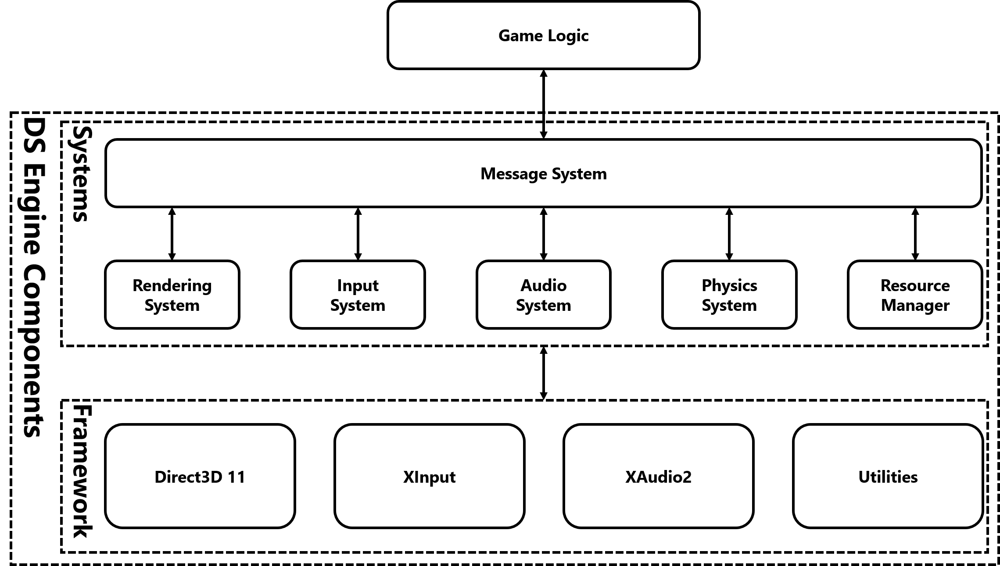

# DS Engine

The DS Engine is a game engine for racing games or driving simulators.

Build Status: 

Document Status: 

Check the automatically generated documentation [here](https://shurunxuan.github.io/IGME750-DSEngine/html/index.html).

## Design

The DS Engine is made up of a framework and several systems. The overall architecture is shown in the figure below.

### Framework

The framework contains low-level components that directly talks to the operating system and other APIs. 

#### Render

The render framework uses Direct3D 11 as its backend. It will handle all drawing requests, including rendering the models and scenes, texts or GUI stuff.

#### Input

The input framework uses XInput as its backend. It will handle all HID input including mouse & keyboard and joysticks. It also supports controller rumble.

#### Audio

The audio framework uses XAudio2 as its backend. It will handle low-level audio clip decoding and streaming. 

#### Utilities

The utilities includes things like maths library, memory management and other useful low-level stuff.

### Systems

The systems play the role of talking to both low-level frameworks and actual game logic. There are also several different systems in DS Engine.

#### Rendering System

The rendering system gathers the information of all game entities, meshes, materials, textures that are used in the game scene and ask the render framework to render the scene.

#### Input System

The input system observes all user inputs that are catched from the input framework, and then send messages to the game logic. It can also receive messages from the game logic for updating the vibration of the controller.

#### Audio System

The audio system asks the audio framework to stream the audio clip. It can also do things like digital signal processing on a specified audio stream to make SFX.

#### Physics System

The physics system does simple rigidbody physics. It also supports physics components and algorithms that is specifically for vehicles or cars.

#### Resource Manager

The resource manager, as its name indicates, manages all the resources used in the game. This includes files like models, materials or audio clips, as well as how they will be used in the game. 

#### Message System

The message system handles the communications between the engine systems and the game logic.
